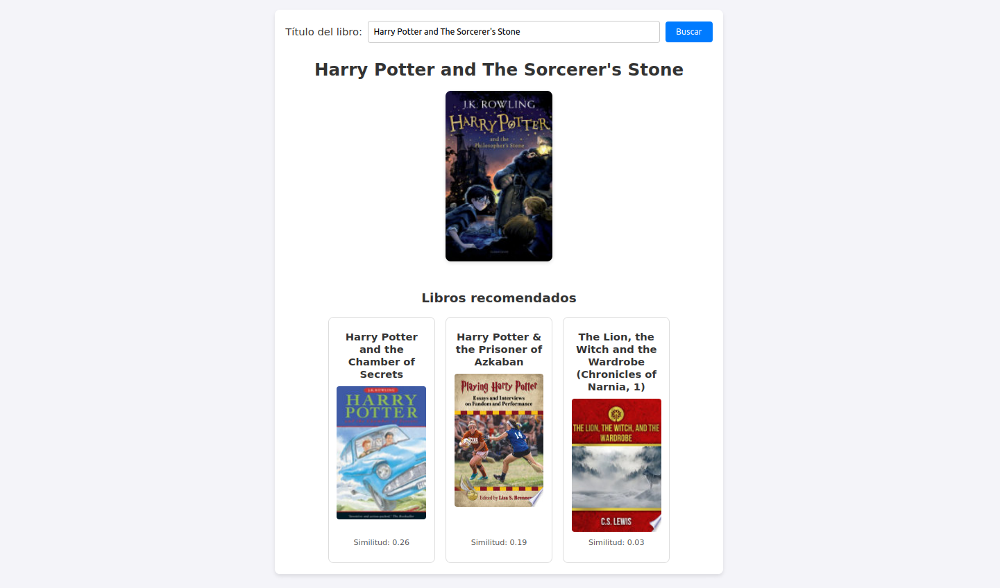

# Recomendador para Ecommerce con IA

Este proyecto es un sistema de recomendación de libros basado en la similitud de calificaciones de los usuarios. El proyecto incluye una interfaz web para que los usuarios puedan buscar libros y recibir recomendaciones, así como una API construida con FastAPI.

## Índice

1. [Funcionalidades](#1-funcionalidades)
    1.1. [Interfaz Web](#11-interfaz-web)
    1.2. [API](#12-api)
    1.3. [Algoritmo de Recomendación](#13-algoritmo-de-recomendación)
2. [Requisitos Previos](#2-equisitos-previos)
3. [Instalación](#3-instalación)
4. [Uso](#4.uso)
5. [Tests](#5.tests)
    5.1. [Ejecución de Tests](#51-ejecución-de-tests)
6. [Contribuciones](#6-contribuciones)
7. [Licencia](#7-licencia)

## 1. Funcionalidades

### 1.1. Interfaz Web

La interfaz web (`app/static/index.html`) permite al usuario buscar un libro por su título. Una vez ingresado el título, se muestra la imagen del libro (si está disponible) y una lista de libros recomendados que son similares al libro buscado.

### 1.2. API

La API está construida con FastAPI y expone dos endpoints principales:

- **`/get_book_image/`**: Devuelve la imagen de un libro basado en el título ingresado.
- **`/get_similar_books/`**: Devuelve una lista de libros similares al libro ingresado, junto con la imagen de cada libro recomendado.

### 1.3. Algoritmo de Recomendación

El sistema de recomendación funciona de la siguiente manera:

1. Carga de Datos: Se carga un archivo CSV (`app/data/bbdd_ratings.csv`) con las calificaciones de los usuarios para diferentes libros.

2. Preprocesamiento: Se limpian los datos eliminando las filas que no tienen imágenes asociadas y se ajustan algunas columnas para que sean más fáciles de trabajar.

3. Creación de la Matriz Item-Usuario: Se crea una matriz en la que cada fila es un libro y cada columna es un usuario, y los valores son las calificaciones que los usuarios han dado a esos libros.

4. Cálculo de Similitudes: Se calcula qué tan similares son los libros entre sí usando la similitud de coseno, que mide qué tan cercanas son las calificaciones de dos libros.

5. Generación de Recomendaciones: Se genera una lista de recomendaciones para cada libro, incluyendo la imagen del libro recomendado.

6. Almacenamiento: Finalmente, se guarda la lista de recomendaciones en un archivo para que pueda ser usada por la aplicación.

## 2. Requisitos Previos

- Python 3.7 o superior

## 3. Instalación

1. Clonar el repositorio:

    ```bash
    git clone https://github.com/rruisan/recomendador-ecommerce.git
    cd recomendador-ecommerce
    ```

2. Crear y activar un entorno virtual:

    ```bash
    python3 -m venv env
    source env/bin/activate     # En Linux/MacOS
    env\\Scripts\\activate      # En Windows
    ```

3. Instalar las dependencias:

    ```bash
    pip install -r requirements.txt
    ```

4. Crear la matriz de recomendaciones:

    ```bash
    python3 app/matrix_creation.py
    ```

5. Iniciar el servidor FastAPI:

    ```bash
    uvicorn main:app --reload
    ```

6. Abrir `app/static/index.html` en tu navegador para usar la aplicación.

## 4. Uso

1. Abre `app/static/index.html` en tu navegador.
2. Introduce el título de un libro en la barra de búsqueda.
3. Haz clic en "Buscar".
4. La imagen del libro aparecerá junto con tres recomendaciones de libros similares.




## 5. Tests

Para asegurar que el proyecto funcione correctamente, se han creado tests automatizados que se pueden ejecutar utilizando pytest. Estos tests validan la funcionalidad de las principales funciones y servicios del proyecto.

### 5.1. Ejecución de Tests

1. Asegúrate de estar en el entorno virtual:

    ```bash
    source env/bin/activate     # En Linux/MacOS
    env\\Scripts\\activate      # En Windows
    ```

2. Instala los requisitos de desarrollo (si los hay) que se encuentran en **requirements.txt**.

3. Ejecuta los tests:

    ```bash
    PYTHONPATH=$(pwd) pytest
    ```

Los tests se encuentran en el directorio tests/ e incluyen validaciones para los módulos principales como test_main.py y test_services.py.

## 6. Contribuciones

Las contribuciones son bienvenidas. Siéntete libre de abrir un **issue** o enviar un **pull request** con mejoras.

## 7. Licencia

Este proyecto está bajo la licencia MIT. Ver el archivo `LICENSE` para más detalles.

